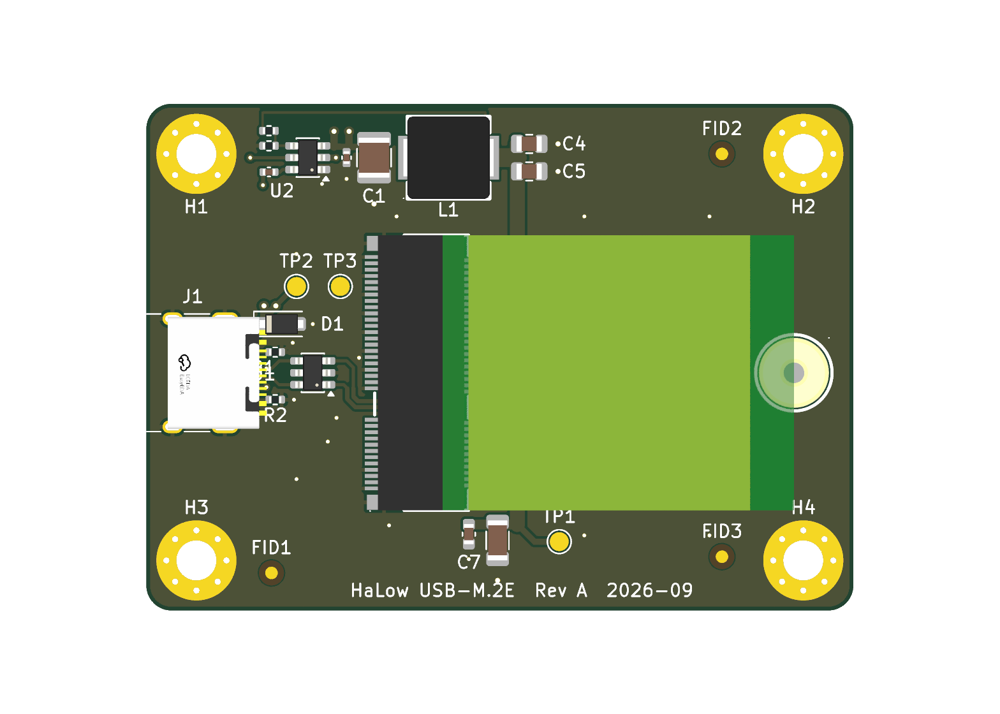

# USB-C to M.2 Key-E HaLow adapter

USB 2.0 over a USB-C receptacle to an M.2 2230 Key-E socket, for the Gateworks
GW16170 (Morse Micro MM8108-M20) Wi-Fi HaLow card. 56.5 x 40.5 mm, 2-layer
(JLCPCB JLC0216A), single-sided assembly.

> **Status: Rev A was sent for fabrication on 2026-09-20 and has not been tested yet.**
> Build it at your own risk until that line changes. The bring-up checks are in
> [`fab/ORDER_NOTES.txt`](fab/ORDER_NOTES.txt) and the pre-fabrication review is in
> [`docs/Design_Review_2026-09-20.md`](docs/Design_Review_2026-09-20.md).

| Block | Parts |
|---|---|
| USB-C input | J1 HRO TYPE-C-31-M-12, R1/R2 5.1k CC pull-downs, U1 USBLC6-2SC6, D1 SMF5.0A |
| 3.3 V / 3 A buck | U2 TPS563201, L1 2.2 uH, C1/C2 in, C4/C5 out, R3/R4 33.2k/10k = 3.32 V |
| M.2 socket | J2 MLD-NGFF-E-4.2H, C6 100 uF, C7 10 uF, C8/C9 100 nF |
| Mechanical | H1-H4 M3, H5 SMTSOM225BTR M2 x 2.5 mm SMT nut for the card |

Only USB D+/D- (M.2 pins 3 and 5), 3.3 V and ground go to the card. W_DISABLE1# (the card's
reset) and W_DISABLE2# (wake) are left open on purpose: the card has its own pull-ups, and its
reset pin uses a power-on RC that an external pull-up would defeat.

## Bill of materials

Full BOM with notes and the parts you supply yourself: **[`BOM.md`](BOM.md)**.
The CSV that went to JLCPCB: [`fab/USBC_M2E_HaLow_Adapter_bom.csv`](fab/USBC_M2E_HaLow_Adapter_bom.csv).

| Ref | Qty | Value | Part number | LCSC |
|---|---|---|---|---|
| U2 | 1 | 3 A buck regulator | TPS563201DDCR | C116592 |
| U1 | 1 | USB ESD array | USBLC6-2SC6 | C7519 |
| D1 | 1 | 5 V TVS | SMF5.0A | C19077497 |
| L1 | 1 | 2.2 µH | CYA0630-2.2UH | C5189746 |
| J1 | 1 | USB-C receptacle | TYPE-C-31-M-12 | C165948 |
| J2 | 1 | M.2 Key-E socket, 4.2 mm | MLD-NGFF-E-4.2H | C52766479 |
| H5 | 1 | M2 x 2.5 mm SMT nut | SMTSOM225BTR | C5301773 |
| C1 | 1 | 10 µF 25 V, 1210 | GRM32DR71E106KA12L | C77100 |
| C6 | 1 | 100 µF 6.3 V, 1206 | CL31A107MQHNNNE | C15008 |
| C4, C5 | 2 | 22 µF 25 V, 0805 | CL21A226MAQNNNE | C45783 |
| C7 | 1 | 10 µF 10 V, 0603 | CL10A106KP8NNNC | C19702 |
| C2, C3, C8, C9 | 4 | 100 nF 16 V, 0402 | CL05B104KO5NNNC | C1525 |
| R1, R2 | 2 | 5.1 kΩ 1 %, 0402 | 0402WGF5101TCE | C25905 |
| R3 | 1 | 33.2 kΩ 1 %, 0402 | FRC0402F3322TS | C2930001 |
| R4 | 1 | 10 kΩ 1 %, 0402 | 0402WGF1002TCE | C25744 |

You also need the GW16170 card, an M2 x 3–4 mm screw, an MMCX antenna or pigtail, and a short
3 A USB-C cable on a port that can supply about 0.9 A.

## How it was made

Everything is generated from Python. Edit the scripts, not the KiCad files. Run with KiCad's Python:

    "C:\Program Files\KiCad\10.0\bin\python.exe" generate_schematic.py --force
    "C:\Program Files\KiCad\10.0\bin\python.exe" autoplace.py . --floorplan
    "C:\Program Files\KiCad\10.0\bin\python.exe" autoplace.py . --place --force
    "C:\Program Files\KiCad\10.0\bin\python.exe" setup_fab.py
    "C:\Program Files\KiCad\10.0\bin\python.exe" route_board.py
    "C:\Program Files\KiCad\10.0\bin\python.exe" drc_report.py
    "C:\Program Files\KiCad\10.0\bin\python.exe" check_m2_clearance.py
    "C:\Program Files\KiCad\10.0\bin\python.exe" build_package.py

`--place` resets every unlocked footprint. Designators moved by hand in KiCad are detected and
kept (`.pcbgen-refs.json`). `route_board.py` redraws every track, via and pour each time it runs.
`build_package.py` writes `fab/` and refuses to run unless DRC is clean.

Mechanical facts, from the MLD-NGFF-E-4.2H drawing:
- the card extends from the even-pin / locating-peg side of the socket;
- the card stop is 1.75 mm behind the pegs, so the 2230 notch is 29.75 mm from the socket centre;
- the card's underside is 2.52 mm above the board; parts under it must be 0.90 mm or lower.

JLCPCB: `setup_fab.py` writes their 2-layer rules into the project and into
`USBC_M2E_HaLow_Adapter.kicad_dru`, with the source pages and date in its docstring. The USB pair
is 0.3345 / 0.1524 mm with ground pour 0.2032 mm either side, from JLCPCB's own calculator for
stackup JLC0216A. JLCPCB does not test impedance on 2-layer boards. `jlc_rotations.json` holds
the placement-file corrections with the evidence for each.

## Repository contents
- `USBC_M2E_HaLow_Adapter.kicad_*`: the KiCad 10 project, schematic, routed board and custom design rules.
- `fab/`: the package sent to JLCPCB for Rev A (gerbers zip, BOM, placement file, order notes).
- `docs/`: schematic PDF, renders, copper images and the pre-fabrication design review.
- `library/`: project symbols, footprints and 3D models.
- `*.py`: the generators. `schlib.py`, `subcircuits.py`, `pcblib.py`, `autoplace.py`, `recipes.py` and `jlc_cpl.py` are copies of the libraries the project was generated with.
- Vendor datasheets are not included.

## Licence

Copyright Diode663 2026.

**Hardware** (the KiCad project, schematic, board, the project's own symbols and footprints,
fabrication outputs and documentation): this source describes Open Hardware and is licensed under
the CERN-OHL-P v2. You may redistribute and modify this source and make products using it under
the terms of the CERN-OHL-P v2 (<https://ohwr.org/cern_ohl_p_v2.txt>), a copy of which is in
[`LICENSE`](LICENSE). This source is distributed WITHOUT ANY EXPRESS OR IMPLIED WARRANTY,
INCLUDING OF MERCHANTABILITY, SATISFACTORY QUALITY AND FITNESS FOR A PARTICULAR PURPOSE. Please
see the CERN-OHL-P v2 for applicable conditions.
Source location: <https://github.com/Diode663/USBC_M2E_HaLow_Adapter>

**Software** (every `*.py` file): MIT, see [`LICENSE-MIT`](LICENSE-MIT).

**Not covered by either licence** — third-party material, included for convenience and owned by
its respective rights holders:
- footprints and 3D models obtained from LCSC / EasyEDA with `easyeda2kicad`:
  `library/HaLowAdapter.pretty/CONN-SMD_MLD-NGFF-E-4.2H.kicad_mod`, `IND-SMD_L7.2-W6.6_GPSR07X0.kicad_mod`,
  `SMTSO_M2_H2.5_SMTSOM225BTR.kicad_mod`, and in `library/HaLowAdapter.3dshapes/` the
  `USB-C_SMD-TYPE-C-31-M-12_1`, `IND-SMD_L7.2-W6.6-H3.0_GPSR07X0` and `SMD_BD5.6-D3.6` models;
- `USB_C_Receptacle_HRO_TYPE-C-31-M-12.kicad_mod` and the M.2 socket symbol, which are modified
  copies from the KiCad libraries (CC-BY-SA 4.0 with the KiCad library exception).

Gateworks, Morse Micro, JLCPCB and the part manufacturers are not affiliated with this project.
